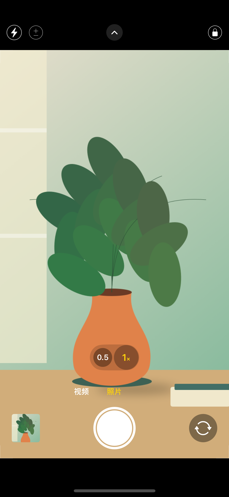
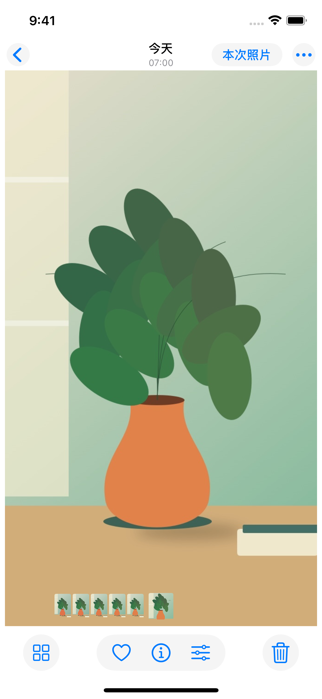
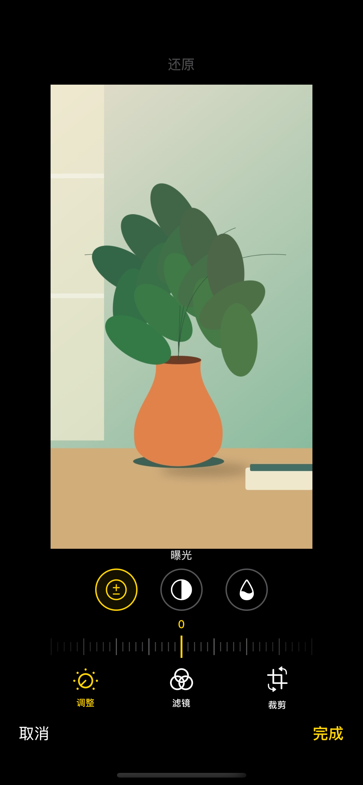

# 借拍 · Session Camera

把 iPhone 交给别人拍照，也让对方只能看到这次拍的照片。

**照片和视频自动存入系统「照片」；左下角预览只显示本次打开期间的内容。** 在借拍里修改照片后，修改通过 PhotoKit 写回系统照片中的同一条记录，原图保留，可恢复。

Public repository: https://github.com/kevin3627713/session-camera

**当前分支：iOS 18 可编辑小组件实验。** 四种原有预设都可通过原生“编辑小组件”切换五种样式，新增按相册 / 文件夹独立随机展示照片和更换周期，默认点击不打开应用。共用原来的一个 WidgetKit 扩展；更新时请保留扩展。用户已确认上一版透明小组件在 iOS 18.7.8 正常使用，本版新增行为仍需真机验收。使用与验证见 [可编辑小组件说明](docs/CONFIGURABLE_WIDGETS.md)，早期描述符研究见 [透明小组件说明](docs/TRANSPARENT_WIDGETS.md)。正式 main 分支保持原版本。

[下载实验版 0.3.0 IPA](https://github.com/kevin3627713/session-camera/releases/download/widgets-ios18-v0.3.0/session-camera-unsigned.ipa) · [实验预发布与验证记录](https://github.com/kevin3627713/session-camera/releases/tag/widgets-ios18-v0.3.0)。

完整构建已通过；真实 iOS 18.6 PhotoKit 测试验证相册、嵌套文件夹、独立编号和图片请求。新版本的主屏翻转、旧组件迁移、材质与点按区域仍需在你的 iOS 18.7.8 手机上验收。

## 界面预览

下图是复用正式 Swift 界面的 iOS 18 模拟器截图，取景内容是专门绘制的测试图。用户提供的真机照片和截图只保留在本地参考目录。

| 相机 | 本次照片 | 照片编辑 |
| --- | --- | --- |
|  |  |  |

完整的两种屏幕尺寸、七种页面状态及来源记录见 [截图目录](docs/screenshots) 和 [界面检查说明](docs/UI_DESIGN.md)。

## 使用

1. 下载 [Releases](https://github.com/kevin3627713/session-camera/releases) 的 `session-camera-unsigned.ipa`，或从 [Actions](https://github.com/kevin3627713/session-camera/actions) 下载构建产物。
2. 使用你自己的签名方式重新签名后安装。编译和打包不需要开发者证书；未签名 IPA 仍需有效签名才能在普通 iPhone 上运行。
3. 首次运行允许相机、照片访问。照片推荐选择「有限访问」；新创建的资产自动包含在有限访问范围内。麦克风只在首次录制视频时申请。
4. 拍照后，点击左下角缩略图，仅查看本次内容。编辑可裁剪、旋转、调整曝光/对比度/饱和度或黑白。
5. 应用进入后台就结束本次相册。返回后创建新会话，已保存的照片继续留在系统照片中。

## 打开后自动进入引导式访问

普通第三方应用不能自己开启引导式访问，但可以由你配置系统「快捷指令」自动化达到这个效果：

1. 设置 → 辅助功能 → 引导式访问，开启并设置密码 / Face ID 与辅助功能快捷键。
2. 完成借拍的首次权限授权，然后在借拍里连按三下侧边按钮，手动开始并测试退出一次。
3. 快捷指令 → 自动化 → App → 选择「借拍」→「被打开」。
4. 选择「立即运行」，添加 **「开始引导式访问」** 动作并保存。
5. 再打开借拍，确认相机右上角变为 **黄色实心锁**，点按可查看「引导式访问已开启」。自动化没有启动时仍可连按三下侧边按钮手动开启。

应用内也有完整配置说明及实时状态。自动化需要你在手机上配置，应用不会声称已代为配置。仅隔离应用内相册不会阻止退出应用；引导式访问可以将整个手机限制在借拍中。

## 已实现

- 对齐用户提供的 iOS 18 真机参考：默认 16:9 照片取景延伸到模式/快门后面，共用胶囊底的倍率按钮、顶部圆形闪光灯/展开箭头、72 pt 快门、48 pt 缩略图与纯箭头前后摄像头按钮。
- 提供 4:3、16:9、1:1 照片比例；保存结果与取景比例一致，横拍和竖拍分别处理正确方向。
- 拍摄选项替换模式行，不挤压取景框；可左右滑动切换模式、上滑展开选项，使用刻度尺调整曝光。
- AVFoundation 高分辨率 JPEG 照片；前后摄像头、按硬件提供超广角/广角/长焦按钮、捏合变焦、点按对焦、长按对焦/曝光锁定、曝光补偿、九宫格与 3/10 秒定时。
- 1080p 视频（硬件支持时），麦克风、自动视频防抖、录像计时及本次视频播放。
- 浅色全屏本次照片浏览，日期/时间顶栏、「本次照片」胶囊、紧凑胶片条、收藏/信息/编辑组合控件与本次网格；点按隐藏工具栏、双击/捏合缩放。收藏与编辑只写回本次系统照片记录。
- 照片编辑采用「调整 / 滤镜 / 裁剪」底部工具、单项刻度尺和裁剪框；PhotoKit 非破坏性编辑与 Core Image 渲染支持裁剪比例、拖动裁剪位置、旋转、曝光、对比度、饱和度、黑白、恢复原图。
- 后台会话失效、拍摄/编辑异步回调隔离、任务切换器遮罩、保存失败提示与重试。
- 崩溃/重启后的未保存文件可后台重试；旧内容不会回到本次相册。引导式访问说明首次展示，之后由右上角图标打开，也可以选择每次提醒。

## 权限与边界

编辑同一条系统照片记录需要 PhotoKit 读写权限。允许「有限访问」即可，借拍只根据本次创建、保存在内存中的照片 ID 调用 `fetchAssets(withLocalIdentifiers:)`，没有枚举系统照片、相册、日期查询、导入照片或跳转系统照片的入口。仅添加照片权限可拍摄保存，但无法同步修改原记录。iOS 可能在编辑提交时弹出确认。

应用不上传照片，没有账号、广告、分析 SDK、服务器或定位权限。当前界面语言为中文，最低 iOS 17。查看 [隐私设计](docs/PRIVACY.md) 和 [验收清单](docs/ACCEPTANCE.md)。

可选随机照片小组件在独立扩展读取你选择的来源，具名相册 / 文件夹需要完整照片访问；有限权限可选已授权照片。它不会把已有照片加入相机的本次预览。每个小组件使用自己的配置与独立编号，默认点击不打开应用。权限管理入口要求机主验证。

本项目追求常用操作和原生相机的布局；没有宣称复刻苹果专有的 Night mode、Smart HDR、Deep Fusion、Photographic Styles、Portrait/Cinematic、Live Photos、ProRAW、全景拼接、系统完整编辑器或 Camera Control 锁屏扩展。这些能力不应以无效按钮伪装成可用功能。当前视频没有剪辑工具，照片可以编辑。移出本次预览只隐藏本地项目，不删除系统照片。

## 构建

沿用 `method` 模板的 Flutter → GitHub macOS runner → `flutter build ios --no-codesign` → `Payload/Runner.app` → IPA 流程。Flutter 3.35.4 固定版本，只负责构建和启动桥接；相机、预览、相册和编辑均由 Swift 原生实现。

```sh
flutter pub get --enforce-lockfile
flutter analyze --fatal-infos
flutter test
swift test --package-path native/SessionCore
flutter build ios --release --no-codesign
bash scripts/package_unsigned_ipa.sh
```

推送 main 或 v* 标签会运行 [构建工作流](.github/workflows/release-ios-unsigned.yml)，标签构建通过后自动发布带 IPA 的 Release。7 项 Swift 测试验证会话隔离、旧回调拒绝、旧编辑拒绝、去重和重新启动隔离；6 项 Core Image / ImageIO 测试直接执行与 iOS 应用共用的源码，验证旋转、裁剪、EXIF、横竖向 16:9 和正方形保存。

新增 [界面检查工作流](.github/workflows/ui-preview.yml)，独立模拟器程序复用实际相机、照片页与编辑页 Swift 源码，在 iOS 18 的 390×844 pt 参考尺寸与 iPhone SE 上生成相机、曝光控制、视频、照片、编辑、裁剪和本次网格截图。参见 [界面设计与检查方法](docs/UI_DESIGN.md)。演示照片仅用于单独的预览构建，发行 IPA 的结构验证会检查它们没有混入正式程序。用户提供的真机参考文件保留在本地 assets，已加入忽略规则。

额外的 iPhone XCTest 宿主测试仍可通过 workflow_dispatch 的 run_simulator 选项运行，尚未取得通过结果，不作为上述截图或共享渲染测试的证据。真机相机、照片权限、系统编辑确认、引导式访问与签名安装仍需在你的 iPhone 验收。

## 模板来源

从本地 `D:\Code\javascripts\gallery\method` 的受版本控制文件复制，保留 MIT 许可证和 `examples/flutter_ipa_ci` 计算器示例及原构建指南，另起全新 Git 历史。没有复制原仓库 `.git`、工作区缓存、证书或本地密钥。本仓库提交使用 `Codex <codex@openai.com>`。

## 查找过的现成应用

截至 2026-10-04 查到的相近产品：[No Peek](https://apps.apple.com/us/app/no-peek-guest-photo-viewer/id6786455744)、[Guest View](https://apps.apple.com/ca/app/guest-view-safe-photo-share/id6756431328)、[TakeALook](https://apps.apple.com/au/app/takealook-safe-photo-handoff/id6801647280)。商店描述主要是挑选已有照片后限制别人浏览，未确认支持「本次相机拍摄 + 自动保存 + 本次预览 + 同步编辑」的完整组合。这是检索结论，不是对整个 App Store 不存在同类产品的保证。

官方资料：[PhotoKit 编辑输出](https://developer.apple.com/documentation/photos/phcontenteditingoutput)、[AVCam](https://developer.apple.com/documentation/avfoundation/avcam-building-a-camera-app)、[引导式访问 API 的 MDM 限制](https://developer.apple.com/documentation/UIKit/UIAccessibility/requestGuidedAccessSession%28enabled%3AcompletionHandler%3A%29)、[引导式访问操作](https://support.apple.com/en-au/111795)、[快捷指令 App 触发器](https://support.apple.com/en-by/guide/shortcuts/apde31e9638b/ios)。自动化实践参考 [TakeALook 的说明](https://tornmetal.com/takealook/protection/)。
